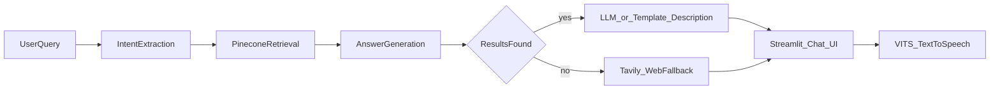

# Real Estate RAG Chatbot

A Vietnamese real-estate search chatbot using RAG over CSV listings, with optional web fallback and text-to-speech.

## Features

- Natural-language property search in Vietnamese
- RAG pipeline: intent extraction → Pinecone vector retrieval → filtered results
- Structured filters: max price (billion VND), min bedrooms/toilets, frontage (`mặt tiền`)
- Optional **Azure OpenAI** for smarter intent parsing and richer listing descriptions
- Optional **Tavily** web search when no internal matches are found
- **VITS TTS** (`facebook/mms-tts-vie`) to read the assistant reply aloud
- Streamlit UI with sidebar config and chat history

## Architecture



The LangGraph pipeline in [`RealEstate/app.py`](RealEstate/app.py) orchestrates intent → retrieval → answer. Pinecone and HuggingFace embeddings are isolated in [`RealEstate/vector_store.py`](RealEstate/vector_store.py).

## Tech Stack

| Layer                   | Technology                                           |
| ----------------------- | ---------------------------------------------------- |
| UI                      | Streamlit                                            |
| Orchestration           | LangGraph                                            |
| Embeddings              | LangChain + `sentence-transformers/all-MiniLM-L6-v2` |
| Vector DB               | Pinecone (serverless)                                |
| LLM (optional)          | Azure OpenAI                                         |
| Web fallback (optional) | Tavily                                               |
| TTS                     | HuggingFace `facebook/mms-tts-vie` + PyTorch         |
| Data                    | CSV (`real_estate_listings.csv`)                     |

See [`RealEstate/requirements.txt`](RealEstate/requirements.txt) for pinned versions.

## Prerequisites

- Python 3.10+
- **Required:** [Pinecone](https://www.pinecone.io/) API key (free tier works for demos)
- **Optional:** Azure OpenAI endpoint + deployment, Tavily API key
- GPU optional (TTS and embeddings run on CPU; slower but functional)
- ~2–4 GB disk for HuggingFace model downloads on first run

## Installation

1. Clone the repo
2. Create and activate a virtual environment at the repo root:

   ```bash
   python -m venv .venv
   # Windows: .venv\Scripts\activate
   # macOS/Linux: source .venv/bin/activate
   ```

3. Install dependencies:

   ```bash
   pip install -r RealEstate/requirements.txt
   ```

4. Copy the env template:

   ```bash
   cp RealEstate/.env.example RealEstate/.env
   ```

5. Fill in `PINECONE_API_KEY` (and optional keys) in `RealEstate/.env`

## Configuration

| Variable                  | Required                        | Purpose                        |
| ------------------------- | ------------------------------- | ------------------------------ |
| `PINECONE_API_KEY`        | Yes                             | Pinecone authentication        |
| `PINECONE_INDEX_NAME`     | No (default: `real-estate-rag`) | Index name                     |
| `AZURE_OPENAI_ENDPOINT`   | No                              | Smarter intent + descriptions  |
| `AZURE_OPENAI_API_KEY`    | No                              | Azure OpenAI auth              |
| `AZURE_OPENAI_DEPLOYMENT` | No                              | Deployment/model name          |
| `TAVILY_API_KEY`          | No                              | Web search when no CSV matches |

Keys can also be entered in the Streamlit sidebar at runtime.

Sidebar options: CSV path, embedding model, VITS model, Pinecone cloud/region, and a **Rebuild index** button.

## Running the App

```bash
cd RealEstate
streamlit run app.py
```

On first launch:

- Loads CSV and displays a preview
- Auto-builds the Pinecone index if empty
- Use **Rebuild index** after changing the CSV or embedding model

## Usage Examples

```
tìm cho tôi nhà dưới 10 tỷ, 2 phòng ngủ, 2WC và nhà mặt tiền
nhà dưới 8 tỷ ở Quận 7
biệt thự trên 10 tỷ
```

The bot returns top matches with enhanced Vietnamese descriptions. Use the TTS button to hear the last assistant reply.

## How It Works

1. **Indexing** — `vector_store.rebuild()` embeds each row's `doc_text` and upserts to Pinecone with metadata.
2. **Retrieval** — Vector search returns candidates; intent-based filters narrow results by price, bedrooms, toilets, and frontage.
3. **Answering** — Top 2 listings get Vietnamese descriptions (Azure OpenAI or template fallback). Zero results trigger Tavily web links.
